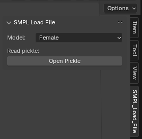

\*\*Please note this modification would not be possible without both the SMPL Blender add-on(https://smpl.is.tue.mpg.de/index.html) and an enhanced version of it that allows the user to render
the poses as a sequence(https://github.com/softcat477/SMPL-to-FBX). If you want to render the corrected script as PNGS then please take advantage of the Loom addon tool(https://github.com/p2or/blender-loom) \*\*

As a basic overview, this Blender script will print all detected collision frames between two joints, and two cylinders (using midpoints) that connect between any two pairs of joints (called bones in Blender). Please note the SMPL-add hierarchy as seen below where the SMPL-male is the figure made up of 24 joints and where the mesh is the actual 3D human mesh that wraps around the joints to make up the human-realistic figure. Currently we instruct the user to use Loom to render the undesired frames but we understand this configuration is not ideal and we are open to suggestions.

- First, install the latest version of Blender, the SMPL-addon is compatible with any version past 2.8. Then head over to the SMPL-to-FBX Github repository and zip the folder "load\_smpl\_addon". Once you successfully installed Blender, please open the python.exe found in the Blender file system and pip install "scipy".
- Second, open the Blender application and find the "Edit" tab in the top left corner. Then scroll down to "Preferences". A drop-down menu should appear, head over to "Add-ons" and in the top right corner click on the down arrow and click "Install from disk". From here please select the zipped folder you installed.
- Thirdly, after successful installation, you should see the following tab appear under "Options". From here you can choose between the male and female SMPL mesh and load it into your pkl file. For test purposes, I recommend selecting the pkl file provided in the repo folder.

- Fourthly, head over to the correction script provided from the repo and copy and paste it under "Scripts". To view the console log, you can select the Window tab (top-left corner) and click on "Toggle System Console". We recommend using the test .pkl file found in the repo. If your given .pkl file contains collisions of other joints/bones, please change the corresponding parts in the code(clearly labeled in the script) Please run the script before you run the animation sequence, we recommend running the animation in 10 FPS to clearly identify collisions.
- Lastly in the console take note of the list of the detected frames listed after the playback is over and then after installing the Loom addon, please head over to "Render Image Sequence" under Render/Loom and select the frames you want to render. After rendering it will provide PNGS of every pose and afterwards you are free to use any PNG to mp4 converter you fancy to see the animation as a whole. You can also render the animation through normal means to create a before and after.

I hope you enjoy using this tool and please provide suggestions regarding the processing of deleted frames. As of late the interpolation tool on Blender that can fill in missing animation curves has been unreliable with the pickle/SMPL format motion sequence.

